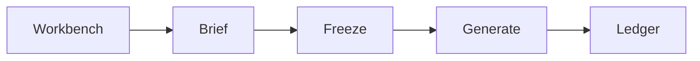

# Product

Preflight is a checklist before a marketing asset ships — same procedure every time, producing a record.

This note is the product story. Locks live in `[documentation/](documentation/)`. Run steps live in the [README](README.md).

## Opening we took

Enterprise marketing in a regulated category stalls on **proof**, not on writing copy.

Four numbers behind that:

- Assets go through **2.9 review rounds** on average. Around 74% need more than one approver.
- **98%** of marketers put late launches down to internal bottlenecks and approvals.
- High-risk regulated content sits **5–10 business days** per asset, per round.
- Only **27%** of agencies say they get a good brief.

Waiting and redoing beat creating. So we took the round out, not the writing.

| Took                                   | Cut                                              |
| -------------------------------------- | ------------------------------------------------ |
| Pre-submit compliance and brand review | Localization fan-out                             |
| Brief → structured intake              | Stakeholder inbox / idle-wait routing            |
| Record around the ledger               | Certification theatre — SOC 2, SSO, legal filing |

A homepage agent starts the campaign. Compile and the ledger stay code. That is **agentic UX, non-agentic proof**.

## Journey

Default route is **Workbench**. Then:

| Step      | What happens                                                                                                 |
| --------- | ------------------------------------------------------------------------------------------------------------ |
| Workbench | GitAgent interviews for a structured brief; handoff runs extract only when every required field is captured. |
| Brief     | Operator reviews the brief; **Build it** runs save → freeze → generate in one chain, or step-by-step.        |
| Freeze    | Code compiles which rules apply. Wording is snapshotted.                                                     |
| Generate  | GitAgent writes copy under that freeze and a Bluepeak brand kit.                                             |
| Ledger    | Every asset has rule id, pass or fail, span, frozen wording.                                                 |

Channel **previews** are the same four fields in a kit frame. Proof is still `canonicalText`. On asset detail, **Verify deterministic checks** re-runs frozen rules read-only and surfaces rulebook drift since freeze — pass/fail on the asset does not change. **Ready for compliance desk** names the next human. It is not multiplayer review.

## Split

| GitAgent                                                    | Code                                   |
| ----------------------------------------------------------- | -------------------------------------- |
| Explainer, extractor, generator — skills + sandboxed `read` | Compile, matchers, hashes, status fold |
| Judge — one call per soft rule, no tools                    | Confirm, override, waive               |

Models never pick compile `ruleIds`. Deterministic matchers never sit on the agent bus.

SEBI-01 has a code safety net: if the generator omits the required disclaimer phrase, the server prepends it before the deterministic engine runs, so that one matcher is not left to chance. The raw model output is still hashed into the agent run. Every other rule is unassisted.

## Skills, not workflows

Each channel's format contract lives in a `SKILL.md` — no new Express route, no generator branch. Wiring it into the product still needs typed edits: add the channel to `ChannelSchema`, map it in `GENERATOR_CHANNEL_SKILL`, add a `channelHints` entry, and a preview component. We ship `channel-tiktok/SKILL.md` as a scale demo; TikTok is not selectable in a brief until those four are done.

Skills are not pasted into the prompt. The agent gets a list of names and paths, then reads the ones it needs — so the LinkedIn call sees LinkedIn's 120-character cap and not the other four channels' conflicting caps. Every read is recorded, so you can see which skills produced a given asset.

## Five decisions

| Decision                                                                          | Why                                                                                           | Trade-off                                                                    |
| --------------------------------------------------------------------------------- | --------------------------------------------------------------------------------------------- | ------------------------------------------------------------------------------ |
| The ledger is the product, not the copywriter.                                    | Review is where the calendar time goes. Proof is the work; copy is not.                       | Generation stays plain. Assets is the hero screen, not Campaign.             |
| Two engines. Code checks the hard rules; one isolated model call checks each soft rule. | "Disclaimer missing" is a fact. "Tone is off" is a reading. One model doing both loses per-rule attribution. | More moving parts. The model alone can never clear or block an asset.        |
| Evidence points at one frozen string. The model's span is a claim; the server finds it. | Trust the model's offsets and you will highlight a lie. Live fields shift; a frozen string does not. | Text only. No images, video, or layout.                                      |
| Status is computed from findings, never stored.                                   | A stored status is a second source of truth, and it drifts from the ledger.                   | Recomputed on every read. Nothing to index or filter on.                     |
| Compile freezes the rule's wording, and nothing travels on regenerate.            | A rule edited Wednesday must not rewrite Monday's proof. A waiver covers one asset, not every future one. | Wording is duplicated per compile. Reviewers decide again after each regenerate. |

## What can a reviewer do when a rule fails?

- **Confirm** — the machine is right. Do not ship. Fix the copy.
- **Override** — the machine misread. Not an exception. Forbidden on deterministic fails.
- **Waive** — the machine is right, ship anyway. Both readings stay. Chip is Exception, never Clear.

## What audit trail sits around the ledger?

The ledger is the proof. These are the records that sit around it:

- Every AI call is logged — which agent, which model, how long, how many tokens. The asset shows who generated the copy.
- Judge runs are locked for consistency; evals check the system still passes known cases.
- Confirm, override, and waive each leave a history — who decided, when, and why, not just the latest chip.
- Rulebook edits require a reason; old wording stays on record.
- If a brief tries to override instructions, it is flagged and logged — nothing is silently fixed.
- Export a compliance report as JSON — freeze, findings, exceptions, and run details in one file.

## What did we leave out — and why?

- Auth, tenants, or a compliance department.
- Approval routing. One operator wears both hats. Naming the next desk is the shape; routing to it is the next surface.
- Jasper's full surface (blogs, SEO, 40 templates).
- Legal filing. Human `clear` is the audit *shape*.
- SOC 2, a model-risk programme, or PII redaction. Shape of a trail, not a certification.
- N locales as one feature. Each locale is another asset.

## Stack

| Layer        | Choice                                              |
| ------------ | --------------------------------------------------- |
| Repo         | Turborepo — two apps, two shared packages           |
| Language     | TypeScript, end to end                              |
| Frontend     | React + Vite                                        |
| Backend      | Express                                             |
| Database     | PostgreSQL + Prisma                                 |
| Styling      | Tailwind + shadcn/ui                                |
| Validation   | Zod, in a shared package                            |
| Agents       | GitAgent (Lyzr OpenGAP), in-process `query()`       |
| Model        | OpenAI `gpt-4o-mini`                                |
| Rule engine  | Plain TypeScript                                    |
| Tests        | Vitest in the packages, `node:test` in the backend  |

Two of those are load-bearing:

- **The rule engine has zero dependencies.** Nothing to install means nothing to drift. That is what makes the determinism claim checkable.
- **Every agent reply is parsed by Zod before it becomes data.** Bad JSON means no asset and no finding — never a silent pass.

## Read next

- [README](README.md) — run locally
- [Walkthrough](https://www.loom.com/share/2e1dccfde6b740f1a604ed5cb3e4b906)
