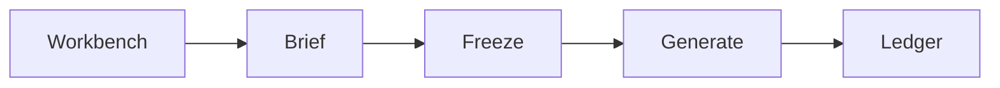

# Product

Preflight is a checklist before a marketing asset ships — same procedure every time, producing a record.

This note is the product story. Locks live in `[documentation/](documentation/)`. Run steps live in the [README](README.md).

## Opening we took

Enterprise marketing in a regulated category stalls on **proof**, not on writing copy.

| Took                                   | Cut                                   |
| -------------------------------------- | ------------------------------------- |
| Pre-submit compliance and brand review | Localization fan-out                  |
| Brief → structured intake              | Stakeholder inbox / idle-wait routing |

A homepage agent starts the campaign. Compile and the ledger stay code. That is **agentic UX, non-agentic proof**.

## Journey

Default route is **Workbench**. Then:

| Step      | What happens                                                     |
| --------- | ---------------------------------------------------------------- |
| Workbench | GitAgent explainer. **Start campaign** runs extract.             |
| Brief     | Operator reviews the structured brief and saves.                 |
| Freeze    | Code compiles which rules apply. Wording is snapshotted.         |
| Generate  | GitAgent writes copy under that freeze and a Bluepeak brand kit. |
| Ledger    | Every asset has rule id, pass or fail, span, frozen wording.     |

Channel **previews** are the same four fields in a kit frame. Proof is still `canonicalText`. **Ready for compliance desk** names the next human. It is not multiplayer review.

## Split

| GitAgent                                                    | Code                                   |
| ----------------------------------------------------------- | -------------------------------------- |
| Explainer, extractor, generator — skills + sandboxed `read` | Compile, matchers, hashes, status fold |
| Judge — one call per soft rule, no tools                    | Confirm, override, waive               |

Models never pick compile `ruleIds`. Deterministic matchers never sit on the agent bus.

## Three decisions

| Decision                                                                     | Trade-off                                                                         |
| ---------------------------------------------------------------------------- | --------------------------------------------------------------------------------- |
| The product is the conformance ledger, not a copywriter.                     | Generation stays constrained. We prove the asset; we do not wow with a writer OS. |
| Hard rules are hashed TypeScript. Soft rules are one isolated LLM call each. | More moving parts. The model alone cannot clear or block an asset.                |
| Skills on talk and generate. Engine and judge stay code.                     | Not a skill-only agent OS. Workflows stay so proof does not leak across assets.   |

## Waive vs override

- **Confirm** — the machine is right. Do not ship. Fix the copy.
- **Override** — the machine misread. Not an exception. Forbidden on deterministic fails.
- **Waive** — the machine is right, ship anyway. Both readings stay. Chip is Exception, never Clear.

## Not this

- Auth, tenants, or a compliance department.
- Jasper's full surface (blogs, SEO, 40 templates).
- Legal filing. Human `clear` is the audit *shape*.
- N locales as one feature. Each locale is another asset.

## Read next

- [README](README.md) — run locally
- [Walkthrough](https://www.loom.com/share/2e1dccfde6b740f1a604ed5cb3e4b906)

